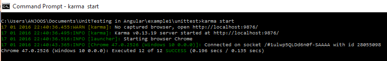

# AngularJS Unit testing examples in Karma and Jasmine

This project contains a few examples for unit testing in AngularJS using Karma and Jasmine

## Pre-requisites

NodeJS and karma-CLI should already be installed.

NodeJS installers can be found [here](https://nodejs.org).

The command to install karma CLI is ```$npm install -g karma-cli```

## Installations

We install the node modules within each project using ```$npm install```

The dependencies for *karma*, *jasmine*, *karma-jasmine* have already been added to the *package.json* of each project.

The karma config file is present inside the *unittest* folder. The configurations are all set to default, except for *files*. For detailed documentation, visit the official sites

- [Karma](http://karma-runner.github.io/0.13/index.html)
- [Jasmine](http://jasmine.github.io/1.3/introduction.html)


## Project structure

Each exampleN folder contains

- App folder
  - index.html
  - css contains all custom CSS definitions
  - lib contains angularJS code
  - js contains all JS code specific to the App
- Unit test folder
  - lib for angular-mocks
  - tests for the test cases
  - karma config file
- package.json

## Getting started

From your command prompt, run

```
   $cd example1
```

```
   $npm install
```

```
   $cd unittest
```

```
   $karma start
```

These commands are common for all examples here. The results of testing are shown in the command interface as shown below.



As long as *karma* is running, any changes are detected and the test cases are executed automatically.

## Projects Included

### example1

This project is a basic calculator app that implements functions for *add*, *subtract*, *multiply* and *divide*.

The unit testing covers testing a stand-alone service and a controller that uses this service.

### example2

This project shows how a service using an AJAX call can be unit tested using the *$httpBackend* service.

### example3

This project tests two filters

- a stand-alone filter
- a filter with a service dependency